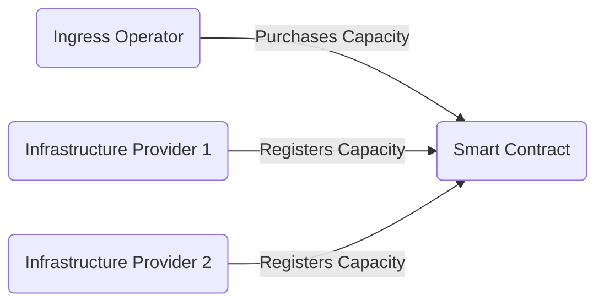
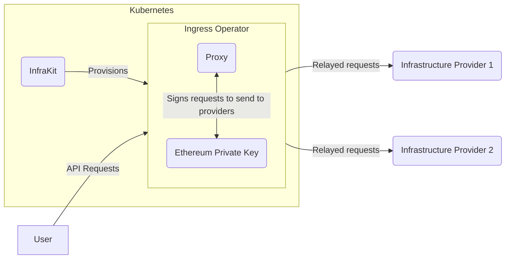

# Ingress Operator Design

First, the Ingress Operator purchases capacity from the network.

Then, an Ingress Operator is deployed to Kubernetes via InfraKit.

The Ingress Operator recieves API requests from a user, signs them with its private key
to prove entitlement, and relays them to the Infrastructure Providers it has purchased
capacity from.